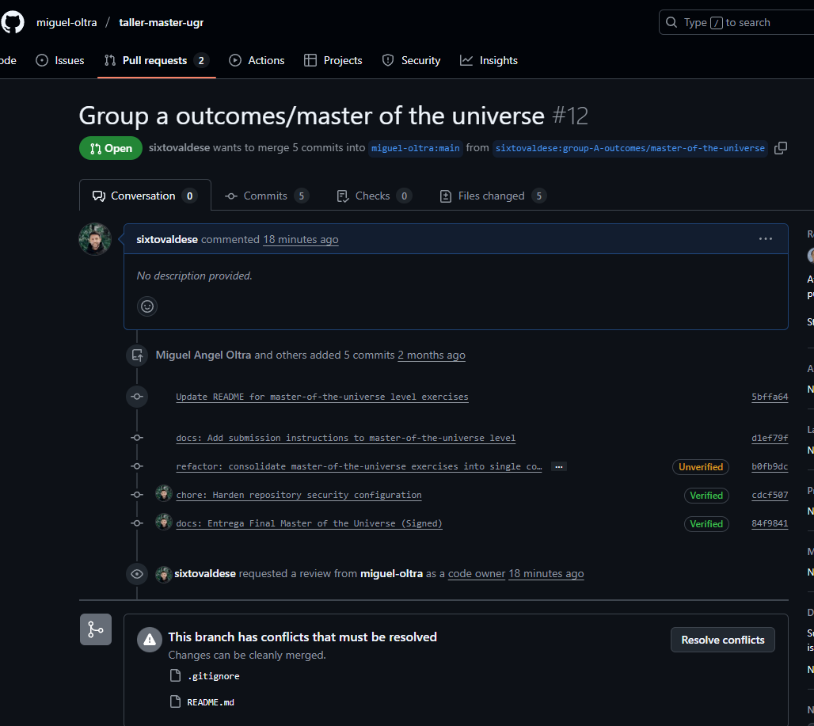
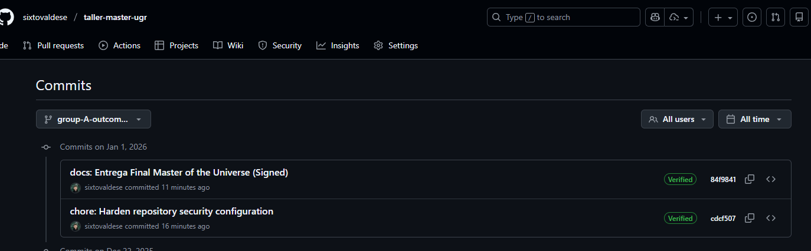

# Resultados: Nivel Master of the Universe (Trabajo Individual)

**Estudiante:** Sixto Valdes (Grupo A)
**Nivel:** master-of-the-universe
**Fecha:** 2026-01-01
**Repositorio:** [https://github.com/sixtovaldese/taller-master-ugr](https://github.com/sixtovaldese/taller-master-ugr)

---

## 1. Resumen Ejecutivo
En este nivel experto se ha implementado una arquitectura de seguridad "Zero Trust". Se han configurado reglas de protección de ramas para impedir cambios no autorizados y un sistema de identidad criptográfica mediante GPG.

## 2. Evidencia de Protección de Ramas
Se ha configurado la rama `main` para exigir "Pull Request". El sistema bloquea la fusión directa y exige revisión (estado "Review required" y escudo de seguridad), como se ve en mi PR #12:



## 3. Evidencia de Firmado GPG (Identidad)
Se ha generado una clave GPG de 4096 bits. GitHub reconoce la firma y otorga la insignia "Verified", garantizando el "No Repudio".



---

## 4. Gestión de Secretos y Auditoría
**Prevención:** Se ha endurecido el archivo `.gitignore` para bloquear extensiones críticas (`*.pem`, `*.key`, `.env`).
**Auditoría:** Se incluye un reporte en `security-artifacts/audit-report.txt` verificando que no existen secretos históricos expuestos.

---

## 5. Reflexión Profesional (Seguridad y DevSecOps)

**¿Por qué es crítica la verificación de commits?**
En entornos CI/CD, el código es la verdad absoluta. Si un atacante roba una contraseña, podría inyectar código malicioso (Supply Chain Attack). El firmado GPG actúa como un pasaporte digital: sin mi clave privada, nadie puede suplantar mi identidad en el historial, aunque tengan mi password de GitHub.

**Protección de Ramas como Gobernanza:**
Las reglas de protección son políticas de calidad. Al exigir "Pull Request" y revisión de Code Owners, implementamos el "Principio de los Cuatro Ojos": ningún cambio llega a producción sin supervisión.

**Estrategia de Gestión de Secretos:**
"Git es para siempre". Borrar un secreto no lo elimina del historial. Mi estrategia es:
1.  **Detección:** Hooks pre-commit para escanear antes de subir.
2.  **Inyección:** Variables de entorno, nunca hardcoded.
3.  **Rotación:** Si un secreto toca Git, se rota inmediatamente.

---

## 6. Logs Técnicos
```text
commit 1e9a0c2a4bf3d467b8d6ecb0fe8e39a47a0b33b9
gpg: Signature made ju.,  1 de ene. de 2026 14:45:15 HSP
gpg:                using RSA key 6BE1A391ABF204685007B7C54C8902BED33F5CC2
gpg: Good signature from "Sixto Valdes <sixto@datacultura.org>" [ultimate]
Author: Sixto Valdes <sixto@datacultura.org>
Date:   Thu Jan 1 14:45:15 2026 -0300

    docs: Entrega Final Master of the Universe (Con Evidencia Visual)

commit 84f9841ecf55b7fab9c78e09c096404baeaf1f95
gpg: Signature made ju.,  1 de ene. de 2026 14:18:29 HSP
gpg:                using RSA key 6BE1A391ABF204685007B7C54C8902BED33F5CC2
gpg: Good signature from "Sixto Valdes <sixto@datacultura.org>" [ultimate]
Author: Sixto Valdes <sixto@datacultura.org>
Date:   Thu Jan 1 14:18:29 2026 -0300

    docs: Entrega Final Master of the Universe (Signed)
```
